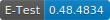

# 调控中心安全生产业务考试系统

## E-Test 考试系统 是一个前端基于 Streamlit 框架，后端基于Python数据处理的web应用，旨在帮助用户进行专业技能自我评估和提升。它包括考试、练习、查询和数据库设置及A.I.试题生成和答案解析等功能，为用户提供一个全面的学习和评估平台

## Contents

- E-Test 考试系统
    
    
  - [安装](#install)
  - [项目结构](#construction)
  - [功能](#functions)
  - [特色](#features)
  - [演示](#demo)
  - [Git-Repository](#git-repository)
  - [License](#license)

## Install

1. 下载并安装[Python](https://www.python.org/)(3.9<=版本<=3.13)
2. 下载并安装[MySQL](https://dev.mysql.com/downloads/mysql/)(8.4.5)
3. 克隆仓库到本地或者解压提供的源代码包
4. 配置环境变量, 将Python和Streamlit的安装路径添加到环境变量中
5. 安装依赖
    - 手工安装
      - MySQL # 数据库
        
      - Streamlit # 前端框架
        
      - streamlit-antd-components/extras/keyup # 前端组件库
        
      - pycryptodome # 数据加密模块
      - openai/qianfan # A.I.调用模块及文心千帆API调用接口
        
        
      - folium/pydeck # 地图可视化
        
      - python-docx # Word文档操作
        
      - openpyxl/XlsxWriter # Excel文档操作
        
      - ...
    - 或使用提供的requirements.txt文件自动安装
      - `pip install -r requirements.txt`
6. 运行程序
    - a. 打开命令行工具cmd或Cmder
    - b. 进入程序目录
    - c. 运行
      - `streamlit run etest.py --server.port 8501`
7. 访问地址
    - 本机运行, 请访问`http://localhost:8501` (端口可使用--server.port参数自行修改)
    - 服务器运行，请访问`http://域名:8501` (具体域名请询问管理员)

## Construction

- .streamlit # Streamlit配置文件, 默认端口8501([修改前请查阅相关文档](https://docs.streamlit.io/develop/api-reference/configuration/config.toml))
- etest.py # 入口文件及主程序 All in one
- commFunc.py # 公共函数
- MyComponentsScript # 自定义组件脚本
- css # css样式文件
- js # js脚本文件
- README.md # 项目说明文件(本文件, Markdown格式)
- requirements.txt # 自动安装依赖文件
- CSC-Project-CustomDict.txt # CSpell自定义字典文件
- 其他各种导出导入文件目录

## Functions

- 考试：用户可以参加考试，系统会根据用户的选择和答案进行评分和记录，并显示和记录考试结果。
- 练习：用户可以练习题目，系统会根据用户的选择和答案进行评分，并显示练习结果。
- 查询：用户可以查询自己的考试记录、错题集和试题练习时间线。
- 数据库设置：管理员可以设置数据库，包括添加、修改和删除用户、站室、和考试信息相关内容。
- A.I.试题生成和答案解析：系统可以使用A.I.技术生成试题和解析答案，帮助用户更好地理解和掌握知识点。
- 题目管理：系统可以管理、添加、修改和删除题目。
- 考试管理：系统可以管理、添加、修改和删除考试信息。
- 考试记录和练习记录管理：系统可以管理用户的考试记录和练习记录及错题和关注题集。

## Features

- 使用A.I.技术根据提供的参考资料自动生成试题，减少出题者的工作量。
- 使用A.I.技术解析答案，详细描述答案推理过程及引用相关法律和条例，帮助用户更好地理解和掌握知识点。
- 个人及站室排行榜及热力图，方便用户了解自己的成绩和排名情况。
- 系统可扩展性：系统可以方便地扩展功能并实时体现，满足用户的需求。
- 双重保护机制：用户密码和数据库关键数据采用AES 256bits加密技术，保护用户的数据安全，并对敏感操作进行二次身份验证。
- 系统日志：系统记录用户的敏感操作，方便管理员进行管理和审计。
- 系统兼容性：系统可以兼容多种浏览器，方便用户使用。
- 系统易用性：系统界面友好，操作简单。

## Demo

[Demo in Streamlit Cloud](https://etest-app-simonpek88.streamlit.app/)

## Git Repository

[E-Test 考试系统](https://github.com/simonpek88/ETest-SQLite.git)

## License

MIT © 2024-2027 Simon Lau TradeMark :rainbow[Enjoy for AP] ™
